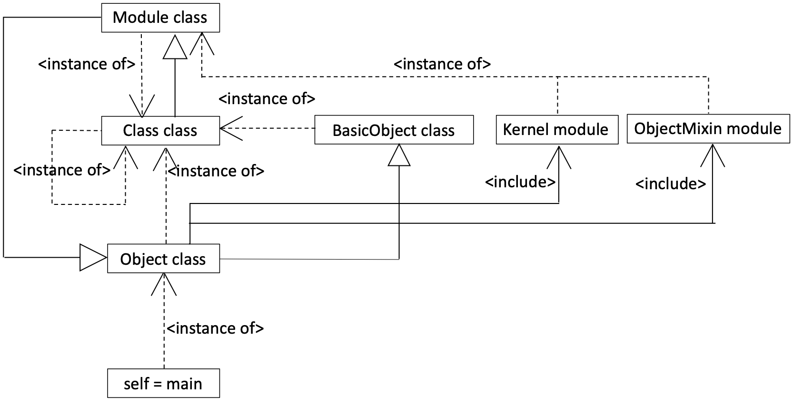

# When you gaze long into the abyss (深淵を覗く時) [995#]

1. [What is self? (自分とは何か?)](#1-what-is-self-%E8%87%AA%E5%88%86%E3%81%A8%E3%81%AF%E4%BD%95%E3%81%8B)
2. [Hello, Ruby world\!\! (こんにちは、Rubyの世界)](#2--hello-ruby-world-%E3%81%93%E3%82%93%E3%81%AB%E3%81%A1%E3%81%AFruby%E3%81%AE%E4%B8%96%E7%95%8C)
3. [When you gaze long into the self (自分自身を見つめる時)](#3-when-you-gaze-long-into-the-self-%E8%87%AA%E5%88%86%E8%87%AA%E8%BA%AB%E3%82%92%E8%A6%8B%E3%81%A4%E3%82%81%E3%82%8B%E6%99%82)

*このチュートリアルは約10分で終了します*

----

## 1. What is self? (自分とは何か?)

Probably. The most interesting thing in the world is *self*, because I know myself exists in this world but I do not know what the self is.  (おそらく世界で最も興味深いことは自分である、なぜなら私は自分がこの世に存在していることを知っているけれども、私は自分が何なのかを知らないからだ。)

If you want to gaze into the abyss, you may need to begin with gazing into the *self*. (深淵を覗こうと思ったら、まずは自分自身を見つめることから始めなければならないかもしれない。) And the reflection (meta-recognition) helps it. (その時に役立つのがリフレクション（メタ認知）だ。)

what_is_self.rb
```ruby
p RUBY_VERSION            #=> 2.7.1
p self                    #=> main
p self.class              #=> Object
p self.class.class        #=> Class
p self.class.class.class  #=> Class

puts
p self.class              #=> Object
p self.class.superclass   #=> BasicObject
p self.class.superclass.superclass #=> nil
p self.class.superclass.class      #=> Class

puts
p self.class.ancestors
#=> [Object, PP::ObjectMixin, Kernel, BasicObject]
p self.class.included_modules
#=> [PP::ObjectMixin, Kernel]
p PP::ObjectMixin.class   #=> Module
p Kernel.class            #=> Module
p Module.class            #=> Class
p Module.superclass       #=> Object
```

* Object#class, Class#superclass, Module#ancestors, Module#included_modules are usuful methods for relfection. (以下のメソッドはリフレクションするのにとても便利だObject#class, Class#superclass, Module#ancestors, Module#included_modules。)
* The first *self* that is given by Ruby God is the top-level object (main). (最初にRubyの神によって与えられる*self*はソースコード全体自身を表す（トップレベル）を表すオブジェクト（main）だ。)
* But interestingly, the *main* itself cannot be seen and we can know it only through the *self*. (しかし、面白いことにそれ自身（mainオブジェクト）を直接参照することはできず、必ず自分（selfオブジェクト）を通すことでしか見ることができない。)

## 2.  Hello, Ruby world!! (こんにちは、Rubyの世界)

First, let's review the technical terms in Object Oriented World. (まず、簡単にオブジェクト指向の世界をおさらいしておこう。)
* The world consists of Objects. (世界は全てオブジェクトによって構成されている。)
* The design of object is *class*, and the generated object based on the *class* is called *instance*. (オブジェクトの設計図に相当するモノがクラス、クラスを元に実体化したモノがインスタンスである。)
* A new *class* can be defined by referring to another *class*. This is called **inheritance**. (あるクラスの性質を引き継いで別のクラスを作ることもできる。これを継承と言う。)

class_instance.rb
```ruby
class Klass
  def hello
    p "Hello, World!!"
  end
end

instance = Klass.new
instance.hello
#=> Hello, World!!
```

Ok. Let's move onto the darkside slowly. Please be careful and step off accidentaly at some point. (ここから少しずつ深淵に少し近づいていくことにしよう。用心して進みながらどこかで足を踏み外して欲しい。)
* *class* and *instance* is object. (まず、クラスもインスタンスもどちらもオブジェクトである。)
* Therefore, There is a *class*  of a *class*, that is called *meta-class*. (そのため、クラスもその設計図に相当するクラスがあり、これをメタクラスと呼ぶ。)
* i.e. There are **two relationships: 1) inheritance (subclass-superclass), 2) instance-class hierarchy**. (つまり、クラスには、継承関係とは別にクラス階層関係がある。)
* In addtion, in Ruby, there is another object, *module*. (Rubyには、もう一つクラスに似たモノにモジュールがある。)
* *module* can define methods as well as *class*, but *module* cannnot inherit either another *module* or generte an instance. (モジュールはクラス同様にメソッドを定義できるが継承することやインスタンスを生成することはできない。)
* Instead, *module* can ben included in a *class*. This is called **Min-in**. (代わりに、クラスに含むことができる。この機能をMix-inと呼ぶ。)

When you gaze into *self* again accodingly, then you can find that the world consists of the mutually dependent objects. (以上のことを踏まえて、selfを見つめると、Rubyの世界は以下のような循環するクラス継承/階層関係で成り立っていることが見えてくる。)



Note
* What may interest to you is that we cannot know the origin of *self* only by gazing into the well-structured world. It is like the origin of life. Which is first, egg or chicken? (興味深いことの一つは、すでに構築された世界を覗いてもselfの起源がわからない点である。 まるで生命の起源を考えているような気分になる。タマゴが先かニワトリが先か。)

## 3. When you gaze long into the self (自分自身を見つめる時)

**You gaze also into the abyss.** (それは、同時に深淵を覗いていることにもなる。)

*by Metaclass Eval*

